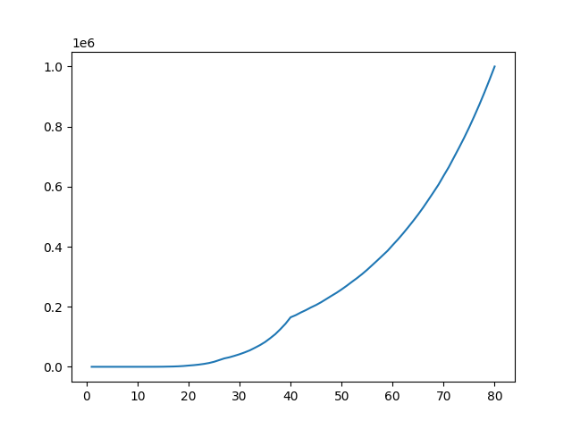
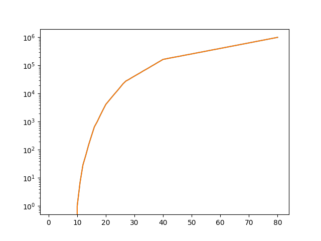
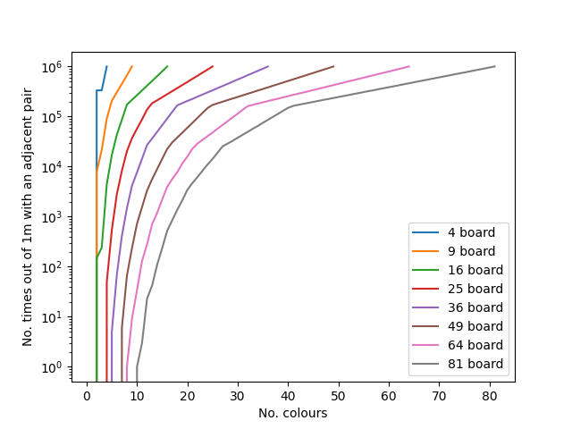

# Maths for a game involving balls

**To do: fix mislabelled vertical axis on `multicolours-1m-runs-log-plot-up-to-9x9.png`, should say "No. times out of 1m with no pair adjacent".**

Game set up involves placing 80 balls in 6 colours on a 9 by 9 board, with no board in the centre. Instructions say to place these randomly, and then says "The idea is that beads of the same color should not be adjacent, horizontal or vertical."

`balls1-9balls.py` investigates this question for 6 colours in the proportions included in the game: 20 red, 15 green and yellow, and 10 blue, orange and purple. 

`balls2-multi-size.py` investigates the effect of changing the number of colours by filling a board 1m times for 1-80 different colours (clearly with 1 colour there is always a match and with 80 colours there is never a match), plotting the result on a regular graph and a log graph. 

Output from running this is included in `data.ods` and in these graphs (horizontal axis is number of colours, vertical is number of times the board was set up without an adjacent pair, or log of this):

`balls3-multi-size2.py` investigates this question for different board sizes from 2x2 to 9x9, with 1m runs each time. Data for each board size is saved in a csv file named like `multicolours-1m-runs-nxn.csv` for an n by n board, with n from 2 to 9.

(Output in `data2.ods` and in `multicolours-100k-runs-log-plot-up-to-9x9.png` is from the same code with 100k runs.)
